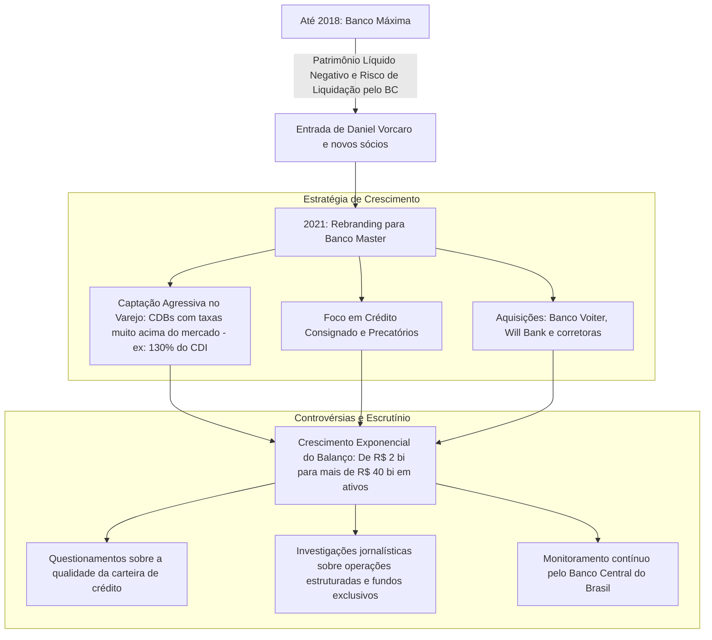

# Memória de Implementação: Banco Master

## Resumo do Tópico
- **Período:** 2018 – Atualidade
- **Categoria:** Economia Contemporânea
- **Foco:** A reestruturação do Banco Máxima, a captação agressiva e o escrutínio do mercado.

## Estrutura da Página (`topics/banco-master.html`)
- **Diagrama Mermaid:** Fluxograma mostrando a transição do Máxima para o Master, a estratégia de crescimento e as controvérsias.
- **Seção 1:** A entrada de Daniel Vorcaro e o rebranding.
- **Seção 2:** A estratégia de captação via CDBs de alta rentabilidade e aquisições.
- **Seção 3:** As dúvidas do mercado sobre a carteira de crédito e o monitoramento do Banco Central.

## Decisões de Design
- O diagrama Mermaid organiza a narrativa em três eixos: a mudança de controle, a estratégia de alavancagem e as consequências (escrutínio).

---

# Caso Banco Master: Expansão Agressiva e Controvérsias

Como uma instituição à beira da liquidação transformou-se em um conglomerado financeiro bilionário sob forte escrutínio regulatório e midiático.

## A Trajetória de Reestruturação e Alavancagem

## 1. O Início: Do Máxima ao Master

Até 2018, o antigo Banco Máxima enfrentava uma grave crise de liquidez, com patrimônio líquido negativo e sob constante ameaça de intervenção ou liquidação extrajudicial pelo Banco Central. A virada ocorreu com a entrada do empresário mineiro **Daniel Vorcaro**, que injetou capital, assumiu o controle e iniciou um agressivo processo de reestruturação.

Em 2021, a instituição foi rebatizada como **Banco Master**, marcando o início de uma das expansões mais rápidas e comentadas do mercado financeiro brasileiro recente.

## 2. A Estratégia de Captação e Aquisições

O motor do crescimento do Master foi a captação de recursos de pessoas físicas através de plataformas de investimento (corretoras). O banco passou a oferecer **CDBs (Certificados de Depósito Bancário) com rentabilidades muito superiores à média do mercado**, atraindo bilhões de reais de investidores de varejo, amparados pela garantia do Fundo Garantidor de Créditos (FGC) até R$ 250 mil.

Com o caixa cheio, o banco diversificou suas operações para crédito consignado, antecipação de precatórios e operações estruturadas de crédito corporativo. Além disso, partiu para aquisições estratégicas, comprando o Banco Voiter (antigo Indusval) e o banco digital Will Bank, ampliando massivamente sua base de clientes.

## 3. Controvérsias e Escrutínio do Mercado

O crescimento vertiginoso gerou desconfiança em setores do mercado financeiro e na imprensa especializada. Reportagens investigativas levantaram questionamentos sobre a qualidade e o risco real da carteira de crédito do banco, apontando para operações complexas envolvendo fundos de investimento exclusivos e debêntures de empresas com balanços frágeis.

O Banco Central mantém a instituição sob rigoroso monitoramento prudencial. A diretoria do Master, por sua vez, defende publicamente a solidez de seus balanços, afirmando que o banco é altamente capitalizado, lucrativo e que as críticas derivam do incômodo gerado pela concorrência agressiva imposta aos grandes bancos tradicionais.
