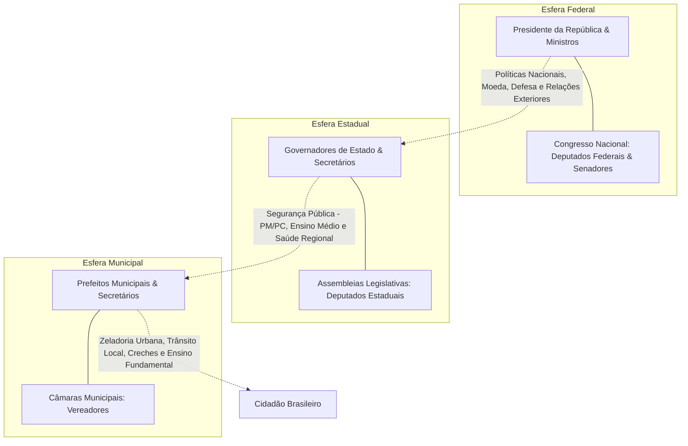

# Memória de Implementação: Composição dos Políticos

## Resumo do Tópico
- **Período:** Estrutura Federativa
- **Categoria:** Instituições
- **Foco:** As atribuições dos cargos políticos nas esferas Municipal, Estadual e Federal.

## Estrutura da Página (`topics/composicao-dos-politicos.html`)
- **Diagrama Mermaid:** Fluxograma mostrando a hierarquia federativa e as responsabilidades de cada esfera em relação ao cidadão.
- **Seção 1:** Esfera Municipal (Prefeito e Vereadores).
- **Seção 2:** Esfera Estadual (Governador e Deputados Estaduais).
- **Seção 3:** Esfera Federal (Presidente, Deputados Federais e Senadores).

## Decisões de Design
- Uso de cores distintas (amber, cyan, violet) para diferenciar visualmente as três esferas da federação ao longo do texto.

---

# Composição dos Políticos e Suas Responsabilidades

O desenho da Federação brasileira: quais são as funções exclusivas, concorrentes e os limites de atuação nas esferas Municipal, Estadual e Federal.

## Organização Federativa e Funções dos Mandatos

## 1. Esfera Municipal: O Cotidiano dos Cidadãos

### Prefeito(a):

Chefe do Executivo local. Administra os serviços de interesse local: transporte coletivo municipal, saneamento básico, postos de saúde da família (UBS), creches e escolas de educação infantil e primeiros anos do ensino fundamental, poda de árvores, iluminação pública e pavimentação asfáltica.

### Vereadores:

Membros do Legislativo municipal. Criam as leis do município (plano diretor urbano, zoneamento, normas edilícias, feriados locais), votam o orçamento municipal e fiscalizam as contas e contratos da prefeitura.

## 2. Esfera Estadual: Segurança e Articulação Regional

### Governador(a):

Comanda a administração pública do Estado e as forças de segurança pública: **Polícia Militar** (policiamento ostensivo e preservação da ordem pública), **Polícia Civil** (polícia judiciária e investigativa) e **Corpo de Bombeiros**. Administra a rede de ensino médio, os hospitais de alta complexidade e as rodovias estaduais.

### Deputados Estaduais:

Atuam na Assembleia Legislativa do Estado. Legislam sobre tributos estaduais (ICMS, IPVA), criam leis de âmbito estadual, fiscalizam os atos do governador e contam com o Tribunal de Contas do Estado (TCE).

## 3. Esfera Federal: Soberania e Diretrizes Nacionais

### Presidente da República:

Chefe de Estado (representa a nação internacionalmente) e Chefe de Governo (lidera a administração pública federal e nomeia ministros). Comandante supremo das Forças Armadas. Tem iniciativa em projetos fiscais e medidas provisórias.

### Deputados Federais (Câmara):

Representam o povo. Iniciam a tramitação da maioria das leis nacionais e reformas constitucionais; autorizam a abertura de processo de impeachment contra o Presidente da República.

### Senadores da República (Senado):

Representam os estados com paridade federativa (3 por estado independentemente da população). Competência privativa para sabatinar e aprovar ministros do STF, PGR e diretores do Banco Central, além de processar e julgar o impeachment do Presidente e de ministros de Estado.
