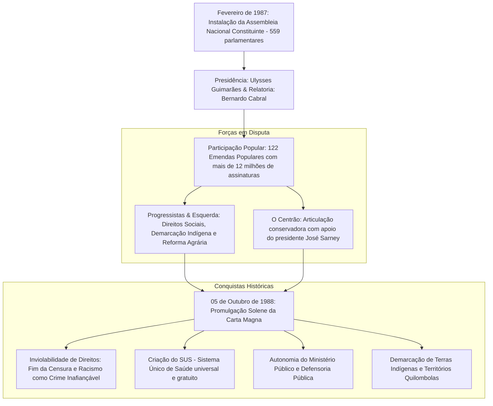

# Memória de Implementação: Constituição Cidadã de 1988

## Resumo do Tópico
- **Período:** 1987 – 1988
- **Categoria:** Redemocratização
- **Foco:** A Assembleia Constituinte, as forças políticas em disputa e as conquistas sociais e civis.

## Estrutura da Página (`topics/constituicao-de-1988.html`)
- **Diagrama Mermaid:** Fluxograma ilustrando a estrutura da Constituinte, as forças em disputa (Progressistas vs. Centrão) e as principais conquistas.
- **Seção 1:** A instalação da Assembleia e a participação popular.
- **Seção 2:** Os principais atores políticos (Ulysses Guimarães, Centrão, movimentos sociais).
- **Seção 3:** Resumo das conquistas (Cidadania, Seguridade Social, Pacto Federativo).

## Decisões de Design
- Estruturação do diagrama Mermaid para evidenciar o embate político (Centrão vs. Progressistas) que moldou o texto final da Constituição.

---

# Constituição Cidadã de 1988

O marco fundador do Estado Democrático de Direito no Brasil: 20 meses de Assembleia Constituinte, intensa participação popular e a consagração dos direitos civis e sociais.

## A Estrutura da Constituinte e o Texto Constitucional

## 1. Quando e Porque Ocorreu

Com o fim da Ditadura Militar em 1985 e a morte trágica de Tancredo Neves antes da posse, o vice-presidente **José Sarney** assumiu o governo com o compromisso de sepultar o entulho autoritário da Constituição de 1967/69.

Eleita em novembro de 1986, a **Assembleia Nacional Constituinte** foi instalada em 1º de fevereiro de 1987. Composta por 559 congressistas (senadores e deputados federais), funcionou durante 20 meses com comissões temáticas abertas e audiências públicas inéditas.

## 2. Quem Apoiou e Políticos Envolvidos

- **Ulysses Guimarães:** Presidente da Constituinte, liderança moral do processo, autor da célebre proclamação: *"Traidor da pátria é o traidor da Constituição. A sociedade foi Rubens Paiva, não os facínoras que o mataram. Quanto a ela, discordar sim; divergir, sim; descumprir, jamais. Afrontá-la, nunca!"*
- **Mário Covas e Florestan Fernandes:** Lideranças que articularam garantias aos direitos sociais e trabalhistas no texto constitucional.
- **O "Centrão":** Bloco suprapartidário conservador liderado por Roberto Cardoso Alves, Inocêncio Oliveira e Amaral Netto, mobilizado para frear avanços da reforma agrária e garantir o mandato presidencial de 5 anos para José Sarney em troca de concessões de rádio e TV.
- **Sociedade Civil:** Movimento indígena liderado por **Ailton Krenak** (com o discurso histórico em que pintou o rosto de preto com jenipapo no plenário), a CNBB, a OAB e entidades sindicais e feministas.

## 3. Principais Conquistas e Desafios

**Cidadania Plena:** Voto facultativo para jovens de 16 e 17 anos e para analfabetos; repúdio formal à tortura; imprescritibilidade do racismo.

**Seguridade Social:** Criação da Seguridade Social com a tríade *Saúde (SUS), Previdência e Assistência Social (LOAS/BPC)*.

**Pacto Federativo e Freios Democráticos:** Fortalecimento sem precedentes do Ministério Público como guardião da ordem jurídica e das minorias, além da ampliação dos legitimados para proposição de Ações Diretas de Inconstitucionalidade (ADIs) no STF.
