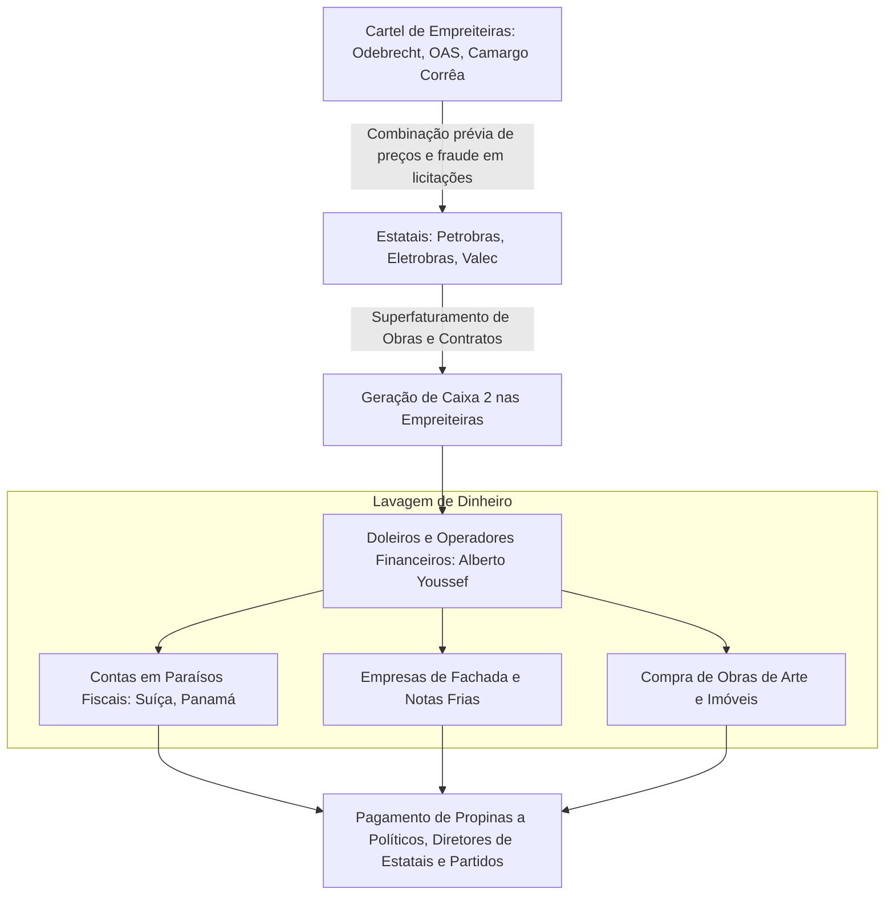

# Memória de Implementação: Corrupção e Lavagem de Dinheiro

## Resumo do Tópico
- **Período:** República Moderna
- **Categoria:** Justiça & Estado
- **Foco:** O histórico de escândalos, o cartel de empreiteiras e a Operação Lava Jato.

## Estrutura da Página (`topics/corrupcao-lavagem-dinheiro.html`)
- **Diagrama Mermaid:** Fluxograma detalhando o modelo Lava Jato: cartel, superfaturamento, doleiros, lavagem e propina.
- **Seção 1:** Breve histórico (Anões do Orçamento, Sivam, Mensalão).
- **Seção 2:** A Operação Lava Jato, o cartel e o envolvimento da Petrobras.
- **Seção 3:** As inovações jurídicas (delações), as prisões e o posterior desmonte da operação.

## Decisões de Design
- O diagrama Mermaid sintetiza o complexo esquema de lavagem de dinheiro descoberto pela Lava Jato, conectando empreiteiras, doleiros e políticos.

---

# Corrupção, Lavagem de Dinheiro e Grandes Escândalos

A anatomia do desvio de recursos públicos no Brasil: o cartel das empreiteiras, o papel dos doleiros na lavagem internacional e o impacto da Operação Lava Jato.

## O Ciclo do Cartel e da Lavagem de Dinheiro (Modelo Lava Jato)

## 1. Histórico de Escândalos na República Moderna

- **Anões do Orçamento (1993):** Deputados que manipulavam emendas orçamentárias para desviar verbas de ministérios para empreiteiras e entidades fantasmas. O caso notabilizou-se pela desculpa do deputado João Alves, que alegou ter ganhado na loteria mais de 200 vezes para justificar sua fortuna.
- **Sivam e Pasta Rosa (Governo FHC):** Denúncias de tráfico de influência no contrato do Sistema de Vigilância da Amazônia e doações ilegais de bancos a campanhas políticas.
- **Mensalão (2005):** Compra de apoio parlamentar no Congresso Nacional durante o governo Lula.

## 2. A Operação Lava Jato (2014 - 2021)

Iniciada em março de 2014 investigando uma rede de doleiros (como Alberto Youssef) que lavava dinheiro em um posto de combustíveis em Brasília, a Lava Jato desvendou o maior esquema de corrupção da história do país, centrado na **Petrobras**.

As maiores empreiteiras do país formaram um cartel ("O Clube") para fraudar licitações da estatal. Elas cobravam sobrepreço nas obras (como a Refinaria Abreu e Lima e o Comperj) e repassavam de 1% a 3% do valor dos contratos em propina para diretores da Petrobras (como Paulo Roberto Costa e Renato Duque) e para os partidos políticos que os indicaram (PT, PMDB e PP).

## 3. Consequências, Prisões e o Desmonte da Operação

A operação inovou com o uso extensivo de **delações premiadas** e cooperação internacional. Levou à prisão ex-presidentes da República (Lula e Michel Temer), o ex-presidente da Câmara Eduardo Cunha, ex-governadores (Sérgio Cabral) e os presidentes das maiores empreiteiras do país (Marcelo Odebrecht).

As empresas assinaram **acordos de leniência** comprometendo-se a devolver bilhões aos cofres públicos. Contudo, a partir de 2019, com o vazamento de mensagens entre o juiz Sergio Moro e os procuradores (Vaza Jato), o STF anulou diversas condenações por considerar que houve parcialidade e quebra do devido processo legal, resultando na soltura da maioria dos políticos e na revisão das multas das empreiteiras.
