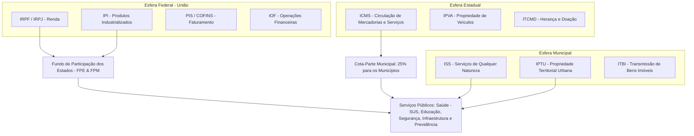

# Memória de Implementação: Criação de Impostos

## Resumo do Tópico
- **Período:** Século XVIII – Atualidade
- **Categoria:** Economia & Estado
- **Foco:** A evolução do sistema tributário brasileiro, desde o Quinto colonial até a recente Reforma Tributária.

## Estrutura da Página (`topics/criacao-de-impostos.html`)
- **Diagrama Mermaid:** Fluxograma ilustrando a arquitetura da arrecadação e repartição federativa (União, Estados, Municípios) e o destino dos recursos.
- **Seção 1:** A origem histórica com o Quinto e a Derrama em Minas Gerais.
- **Seção 2:** Detalhamento dos principais impostos modernos (IRPF, ICMS, ISS, IPTU/IPVA) com cards estilizados.
- **Seção 3:** Breve explicação sobre a Reforma Tributária (EC 132/2023) e o modelo de IVA Dual.

## Decisões de Design
- Uso de um grid de cards para apresentar os impostos modernos de forma clara e comparativa, facilitando a leitura.

---

# Criação de Impostos e o Sistema Tributário no Brasil

Da revolta colonial contra o "Quinto" e a Derrama em Minas Gerais até o complexo pacto federativo moderno e a unificação do IVA (IBS/CBS).

## Arquitetura da Arrecadação e Repartição Federativa

## 1. Origem Histórica: O Quinto e a Derrama

A cobrança de tributos no Brasil iniciou-se no século XVIII durante o ciclo do ouro em Minas Gerais. A Coroa Portuguesa instituiu o **Quinto** (20% de todo metal fundido nas Casas de Fundição). Quando a produção de ouro entrou em declínio natural e as metas de 100 arrobas anuais não eram atingidas, Portugal decretou a **Derrama** (cobrança forçada que confiscava bens dos colonos).

O peso opressivo da tributação régia foi o estopim direto para a **Inconfidência Mineira (1789)**, demonstrando desde os primórdios coloniais a tensão política em torno do destino da arrecadação pública.

## 2. Principais Impostos Modernos: Onde é Arrecadado e Para Que Serve

### IRPF / IRPJ (Imposto de Renda Pessoa Física / Jurídica)

**Criado em:** 1922 pela Lei Orçamentária nº 4.625.

**Arrecadador:** União (Receita Federal).

**Aplicação:** Orçamento geral da União, saúde, previdência social, Forças Armadas e transferências obrigatórias para Estados e Municípios (FPE e FPM).

### ICMS (Imposto sobre Circulação de Mercadorias e Serviços)

**Criado em:** Sucessor do ICM de 1966, reformulado na Constituição de 1988.

**Arrecadador:** Estados e Distrito Federal (maior fonte de receita estadual).

**Aplicação:** Segurança pública (Polícia Militar/Civil), hospitais estaduais e universidades. 25% da receita pertence aos municípios do respectivo estado.

### ISS (Imposto Sobre Serviços)

**Criado em:** Regulamentado em 1966 e consolidado pela Lei Complementar 116/2003.

**Arrecadador:** Municípios.

**Aplicação:** Postos de saúde municipais (UBS), manutenção urbana, asfaltamento e escolas de ensino infantil e fundamental.

### IPTU e IPVA (Impostos sobre Patrimônio)

**IPTU:** Arrecadado pelas prefeituras para obras urbanas e zeladoria.

**IPVA:** Arrecadado pelos estados (50% repassado ao município onde o veículo está emplacado) para infraestrutura e serviços públicos gerais.

## 3. A Reforma Tributária (EC 132/2023)

A promulgação da Emenda Constitucional 132/2023 instituiu o modelo de **IVA Dual (Imposto sobre Valor Agregado)** para simplificar o sistema: substituindo o PIS, Cofins e IPI pela **CBS (Contribuição sobre Bens e Serviços)** federal, e o ICMS e ISS pelo **IBS (Imposto sobre Bens e Serviços)** subnacional, com cobrança no destino da mercadoria e fim da cumulatividade.
