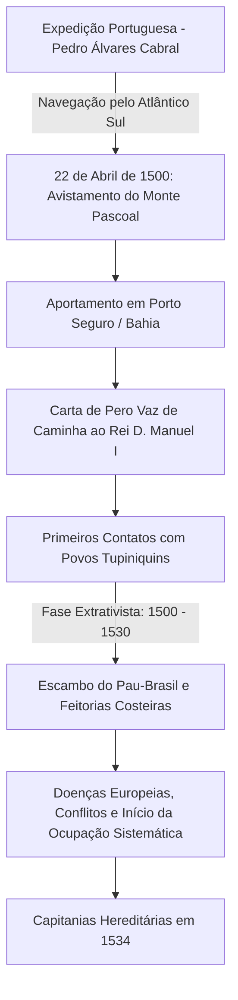

# Memória de Implementação: Descobrimento do Brasil

## Resumo do Tópico
- **Período:** 1500
- **Categoria:** Colônia
- **Foco:** A chegada da frota de Pedro Álvares Cabral, a Carta de Pero Vaz de Caminha e os impactos iniciais sobre os povos originários.

## Estrutura da Página (`topics/descobrimento-do-brasil.html`)
- **Diagrama Mermaid:** Fluxograma detalhando a viagem, o aportamento, o primeiro contato e a transição para a fase extrativista (pau-brasil) e posterior colonização (capitanias).
- **Seção 1:** O contexto da viagem e o Tratado de Tordesilhas.
- **Seção 2:** A importância histórica da Carta de Caminha.
- **Seção 3:** Os efeitos colaterais, incluindo o impacto demográfico sobre os indígenas e o início da exploração econômica.

## Decisões de Design
- Uso de cores temáticas (emerald, amber, rose) para destacar as diferentes seções.
- Inclusão de citação em bloco (blockquote) para trecho da Carta de Caminha, melhorando a imersão histórica.

---

# Descobrimento do Brasil (1500)

A expedição de Pedro Álvares Cabral, o encontro entre culturas pré-colombianas e a Coroa Portuguesa, e o início da colonização mercantile extrativista.

## Fluxograma do Evento & Dinâmica Colonial

## 1. O que Aconteceu

Em 22 de abril de 1500, a armada lusitana comandada pelo fidalgo Pedro Álvares Cabral, composta por 13 embarcações e cerca de 1.500 homens, avistou terras que inicialmente foram batizadas de "Ilha de Vera Cruz" e, posteriormente, "Terra de Santa Cruz". O objetivo oficial era navegar contornando a África em direção às Índias para consolidar o comércio de especiarias estabelecido por Vasco da Gama em 1498.

Historiadores apontam que a rota intencionalmente se afastou da costa africana ("volta do mar"), havendo fortes indícios de que Portugal já possuía conhecimento prévio da existência de terras a oeste, o que justificou as negociações do **Tratado de Tordesilhas (1494)**, que dividiu as terras a serem descobertas com a Espanha a 370 léguas das ilhas de Cabo Verde.

## 2. A Carta de Pero Vaz de Caminha e o Primeiro Contato

O escrivão Pero Vaz de Caminha redigiu a carta ao rei Dom Manuel I, considerada a "certidão de nascimento" do Brasil colonial. No texto, Caminha descreve a exuberância da natureza, a ausência aparente de metais preciosos imediatos e a curiosidade recíproca dos povos indígenas locais (predominantemente Tupiniquins):

> "Até agora não pudemos saber se há ouro ou prata nela, ou outra coisa de metal, ou ferro; nem lha vimos. Contudo a terra em si é de muito bons ares, frescos e temperados [...]. Em tal maneira é graciosa que, querendo-a aproveitar, dar-se-á nela tudo; por causa das águas que tem!"

## 3. Efeitos Colaterais e Impacto Histórico

- **Genocídio e Epidemias:** Estima-se que viviam de 3 a 5 milhões de indígenas em território brasileiro em 1500. A introdução de patógenos europeus (gripe, varíola, sarampo) e as guerras de conquista reduziram drasticamente essa população nos primeiros dois séculos.
- **Economia do Escambo e Exploração do Pau-Brasil:** Nos primeiros 30 anos (período pré-colonial), os portugueses estabeleceram feitorias costeiras. Indígenas cortavam e transportavam as toras em troca de ferramentas de ferro, tecidos e espelhos.
- **Transição para a Colonização Efetiva:** As ameaças de corsários franceses levaram a Coroa a enviar a expedição colonizadora de Martim Afonso de Sousa em 1530 e a criar as **Capitanias Hereditárias em 1534**, dando início à lavoura canavieira e à escravização sistemática.
