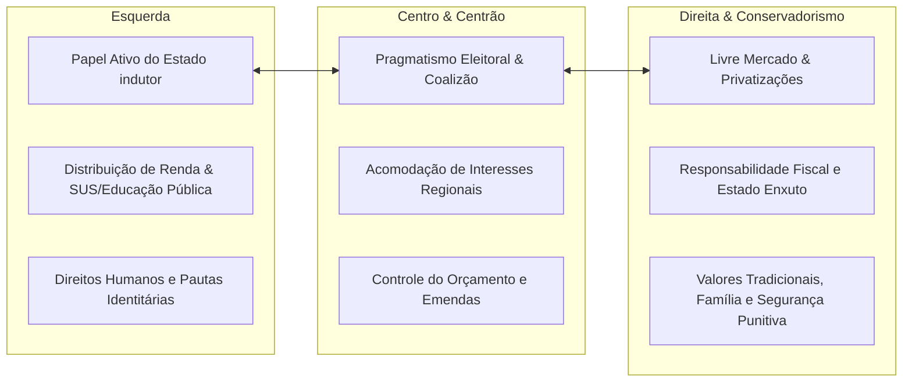

# Memória de Implementação: Diferenças de Posições Políticas

## Resumo do Tópico
- **Período:** Contemporâneo
- **Categoria:** Política
- **Foco:** O espectro político brasileiro (Esquerda, Centro/Centrão, Direita) e suas pautas.

## Estrutura da Página (`topics/diferencas-posicoes-politicas.html`)
- **Diagrama Mermaid:** Gráfico da esquerda para a direita mostrando os eixos ideológicos e o pragmatismo do Centro.
- **Seção 1:** A Esquerda (valores e pautas).
- **Seção 2:** O Centro e o Centrão (fisiologismo e pragmatismo).
- **Seção 3:** A Direita (valores e pautas).

## Decisões de Design
- Abordagem neutra e descritiva, focando nos valores declarados e nas pautas práticas de cada campo político, com destaque especial para a distinção entre Centro ideológico e Centrão fisiológico.

---

# Diferenças de Posições Políticas no Brasil

Como se estruturam a Esquerda, o Centro (e o Centrão fisiológico) e a Direita no cenário brasileiro: valores fundamentais, papel do Estado e pautas prioritárias.

## Espectro Político e Eixos de Convergência / Divergência

## 1. A Esquerda no Brasil

**Valores Centrais:** Igualdade social, redução das assimetrias de classe e raça, defesa dos direitos dos trabalhadores e soberania nacional sobre recursos estratégicos (como petróleo e energia).

**Pautas que defendem:**

- Estado de bem-estar social financiado por tributação progressiva sobre grandes fortunas e dividendos;
- Fortalecimento dos serviços públicos universais (SUS, universidades federais, programas de transferência como o Bolsa Família);
- Reforma agrária e proteção ambiental rígida em biomas como a Amazônia e o Cerrado;
- Defesa dos direitos LGBTQIA+, igualdade de gênero, demarcação de terras indígenas e combate ao racismo estrutural.

## 2. O Centro e o Fenômeno do "Centrão"

No Brasil, é essencial distinguir o *Centro programático* (social-democracia clássica e liberalismo social moderado) do chamado **Centrão**.

O Centrão é um agrupamento informal de partidos com forte enraizamento regional (como PP, Republicanos, União Brasil, PSD) que não se define prioritariamente por convicções ideológicas rígidas, mas sim pelo **fisiologismo pragmático**: negociam votos e sustentação parlamentar com qualquer presidente (seja de esquerda ou de direita) em troca do controle de cargos em ministérios, autarquias e liberação de emendas orçamentárias.

## 3. A Direita no Brasil

**Valores Centrais:** Liberdade individual, direito irrestrito de propriedade privada, mérito pessoal, livre concorrência e preservação de valores morais e religiosos tradicionais.

**Pautas que defendem:**

- Desregulamentação da economia, redução de encargos trabalhistas e desestatização de empresas estatais;
- Teto de gastos públicos e austeridade fiscal estrita;
- Endurecimento penal, facilitação do acesso a armas de fogo para legítima defesa e combate militarizado ao crime organizado;
- Posicionamento contrário à legalização do aborto e das drogas recreativas, alinhando-se frequentemente a bancadas evangélicas e do agronegócio (bancada da bala, boi e bíblia).
