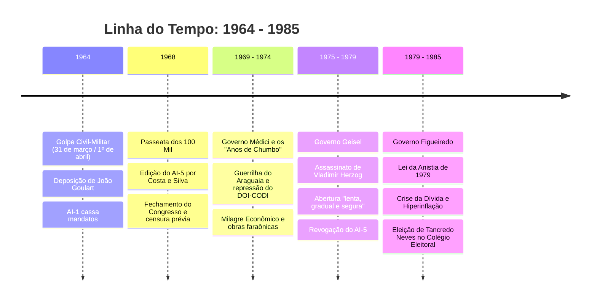

# Memória de Implementação: Ditadura Militar

## Resumo do Tópico
- **Período:** 1964 – 1985
- **Categoria:** Regime Militar
- **Foco:** O golpe de 64, a repressão institucionalizada, o apoio civil-empresarial e a transição para a democracia.

## Estrutura da Página (`topics/ditadura-militar.html`)
- **Diagrama Mermaid:** Gráfico do tipo `timeline` detalhando os principais eventos e governos militares de 1964 a 1985.
- **Seção 1:** O contexto da Guerra Fria e a deposição de João Goulart.
- **Seção 2:** A conspiração civil-empresarial e o apoio dos EUA.
- **Seção 3:** O AI-5, a censura e a repressão (DOI-CODI).
- **Seção 4:** O fim do milagre econômico, a Lei da Anistia e a eleição de Tancredo Neves.

## Decisões de Design
- Escolha do tipo `timeline` no Mermaid para representar de forma clara a sucessão de governos e eventos ao longo dos 21 anos de regime.

---

# Ditadura Militar no Brasil (1964 – 1985)

Vinte e um anos de autoritarismo: a deposição de João Goulart, os Atos Institucionais, a censura aos meios de comunicação, o aparato de tortura e a dívida externa recorde.

## Evolução Cronológica do Regime Militar

## 1. Quando e Porque Ocorreu

Em 31 de março de 1964, tropas lideradas pelo general Olímpio Mourão Filho marcharam de Juiz de Fora (MG) em direção ao Rio de Janeiro, consumando o golpe militar com o apoio do governador Magalhães Pinto e do Congresso Nacional, que declarou vaga a Presidência da República mesmo com o presidente eleito **João Goulart (Jango)** ainda em território nacional (no Rio Grande do Sul).

O pretexto ideológico foi a **Guerra Fria** e a Doutrina de Segurança Nacional formulada na Escola Superior de Guerra (ESG): frear uma suposta "ameaça comunista" após Jango apresentar o programa das **Reformas de Base** (reforma agrária, tributária, educacional e bancária) no Comício da Central do Brasil em março de 1964.

## 2. Quem Apoiou: A Conspiração Civil-Empresarial e Internacional

- **Governo dos Estados Unidos:** Operação *Brother Sam*, organizada pelo embaixador Lincoln Gordon e pelo adido militar Vernon Walters, que mobilizou uma esquadra naval americana com porta-aviões para intervir caso houvesse resistência armada pró-Goulart.
- **Elites Empresariais e Financeiras:** O Instituto de Pesquisas e Estudos Sociais (IPÊS) e o Instituto Brasileiro de Ação Democrática (IBAD), financiados por industriais e multinacionais (como multinacionais automotivas e construtoras civis).
- **Grande Imprensa e Igreja:** Os principais veículos de comunicação da época editorializaram em favor da intervenção militar, e setores conservadores da Igreja organizaram as *Marchas da Família com Deus pela Liberdade*.
- **Líderes Civis:** Governadores como Carlos Lacerda (Guanabara), Magalhães Pinto (Minas Gerais) e Adhemar de Barros (São Paulo), que imaginavam que os militares devolveriam o poder nas eleições previstas para 1965.

## 3. Anos de Chumbo e Repressão Sistemática

Em 13 de dezembro de 1968, o general Costa e Silva decretou o **Ato Institucional nº 5 (AI-5)**, o mais repressivo do período. O AI-5 fechou o Congresso, suspendeu a garantia de *habeas corpus* para crimes políticos, instituiu a censura prévia à imprensa, música e teatro, e conferiu ao presidente poder sumário de cassação.

Criou-se a estrutura clandestina de repressão através do **DOI-CODI** e da Operação Bandeirantes (OBAN). O Relatório da Comissão Nacional da Verdade (2014) comprovou que o Estado brasileiro foi responsável por ao menos **434 mortos e desaparecidos políticos**, além de milhares de cidadãos torturados nos porões da ditadura.

## 4. Quando e Como Acabou

O regime começou a se desgastar em meados dos anos 1970 pelo fim do "Milagre Econômico" (gerado pelos choques do petróleo de 1973 e 1979 e explosão da dívida externa), protestos pelo assassinato do jornalista **Vladimir Herzog (1975)** e as greves operárias do ABC paulista lideradas por Lula a partir de 1978.

O general Ernesto Geisel iniciou o processo de abertura "lenta, gradual e segura". Em 1979, o general João Figueiredo sancionou a **Lei da Anistia (Lei 6.683/1979)** — que permitiu o retorno dos exilados políticos, mas também concedeu autoanistia aos agentes estatais acusados de tortura e assassinatos. O ciclo ditatorial encerrou-se formalmente em 15 de janeiro de 1985 com a vitória de **Tancredo Neves** no Colégio Eleitoral.
