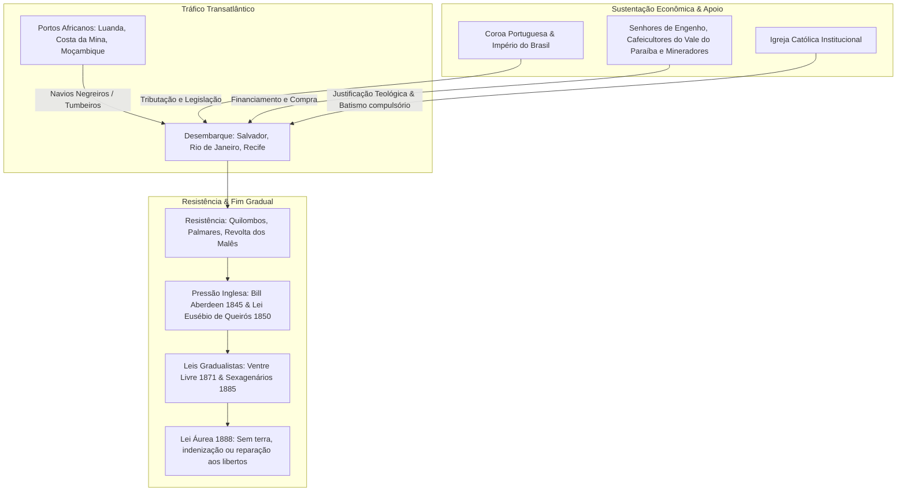

# Memória de Implementação: Escravidão no Brasil

## Resumo do Tópico
- **Período:** 1530 – 1888
- **Categoria:** Colônia & Império
- **Foco:** O tráfico transatlântico, a sustentação econômica do regime escravocrata e a abolição tardia sem reparação.

## Estrutura da Página (`topics/escravidao-no-brasil.html`)
- **Diagrama Mermaid:** Fluxograma dividindo o tema em três eixos: Tráfico Transatlântico, Sustentação Econômica & Apoio, e Resistência & Fim Gradual.
- **Seção 1:** As origens da escravidão africana em substituição à indígena e os números do tráfico.
- **Seção 2:** Os setores que apoiaram (Coroa, elite agrária, comerciantes, Igreja).
- **Seção 3:** A Lei Áurea e as consequências sociais da falta de políticas de integração para os libertos.

## Decisões de Design
- O diagrama Mermaid foi estruturado com subgrafos para organizar visualmente a complexidade do sistema escravocrata.

---

# Escravidão no Brasil (1530 – 1888)

Mais de três séculos e meio de regime escravocrata: a estrutura do comércio negreiro, as classes dominantes que o sustentaram e os impactos perenes de desigualdade no país.

## A Dinâmica do Tráfico e a Estrutura da Escravidão

## 1. Como Começou

A escravidão no Brasil teve início na década de 1530 com a escravização dos povos indígenas ("o negro da terra") nas lavouras e no corte de madeira. Conforme as ordens religiosas (especialmente os Jesuítas) resistiam à escravização indígena e as epidemias dizimavam as aldeias litorâneas, a Coroa Portuguesa estruturou o **tráfico transatlântico de africanos escravizados**.

O tráfico negreiro tornou-se um dos negócios mais lucrativos do comércio colonial global. O Brasil foi o maior receptor de escravizados das Américas: estima-se que quase **5 milhões de africanos** foram desembarcados vivos no país entre 1550 e 1856, espalhados pelas plantações de cana-de-açúcar, jazidas de ouro e diamantes em Minas Gerais e, posteriormente, pelos cafezais de São Paulo e do Rio de Janeiro.

## 2. Quem Apoiou e Setores Envolvidos

- **A Coroa Portuguesa e o Império do Brasil:** Arrecadavam volumosos tributos alfandegários sobre a entrada de cada cativo nos portos (os "direitos de alfândega").
- **Elite Agrária e Cafeicultora:** Proprietários de terras e senhores de escravos exerciam controle político absoluto. Durante o Império, os "Barões do Café" do Vale do Paraíba foram os maiores defensores da escravidão.
- **Comerciantes de Escravos:** Grandes redes mercantis no Rio de Janeiro, Salvador e Recife, conectadas a armadores de navios negreiros e traficantes que operavam em Luanda, Benguela e na Baía de Benin.
- **Apoio Institucional e Jurídico:** A Constituição de 1824 e o Código Criminal de 1830 protegiam a escravidão como direito de propriedade privada inalienável.

## 3. A Abolição Tardia e a Falta de Reparação

O Brasil foi o último país do Ocidente a abolir a escravidão, em 13 de maio de 1888, por meio da **Lei Áurea**, assinada pela Princesa Isabel após intensa pressão do movimento abolicionista (liderado por nomes como **Luís Gama, André Rebouças, José do Patrocínio e Machado de Assis**) e de frequentes fugas em massa de fazendas.

Entretanto, a abolição foi puramente formal. O Estado brasileiro não concedeu terra, indenização, educação básica ou moradia aos recém-libertos. Pelo contrário, promoveu subsídios governamentais para a imigração europeia (política de branqueamento da população), empurrando a população negra para a informalidade, periferias e favelas, consolidando um racismo estrutural que perdura até os dias de hoje.
