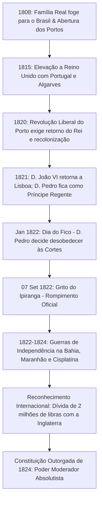

# Memória de Implementação: Independência do Brasil

## Resumo do Tópico
- **Período:** 1822
- **Categoria:** Império
- **Foco:** O processo de ruptura com Portugal, as guerras provinciais e a manutenção da estrutura monárquica e escravocrata.

## Estrutura da Página (`topics/independencia-do-brasil.html`)
- **Diagrama Mermaid:** Linha do tempo em formato de fluxograma detalhando os eventos desde a vinda da Família Real (1808) até a Constituição Outorgada (1824).
- **Seção 1:** O contexto político e o Grito do Ipiranga.
- **Seção 2:** Desmistificação da independência pacífica, citando as guerras na Bahia e no Piauí.
- **Seção 3:** Os efeitos colaterais conservadores (manutenção da escravidão, dívida externa, autoritarismo).

## Decisões de Design
- Destaque para as guerras de independência, frequentemente negligenciadas no ensino básico, utilizando listas para facilitar a leitura.

---

# Independência do Brasil (1822)

O processo de separação política da metrópole, o papel de Dom Pedro I e José Bonifácio, os conflitos militares sangrentos nas províncias e a preservação do latifúndio escravista.

## Evolução da Crise e Ruptura com Lisboa

## 1. O que Aconteceu

A transferência da corte portuguesa para o Rio de Janeiro em 1808, sob escolta da Marinha Britânica para escapar das tropas de Napoleão Bonaparte, transformou o Brasil no centro do império lusitano. A **Abertura dos Portos às Nações Amigas** pôs fim ao pacto colonial mercantilista.

Em 1820, a Revolução Liberal do Porto exigiu o regresso de D. João VI e tentou rebaixar o Brasil novamente à condição de colônia subordinada. As elites locais (proprietários de terras, burocratas e comerciantes liderados por **José Bonifácio de Andrada e Silva** e pela princesa **Maria Leopoldina**) articularam junto a Dom Pedro a permanência no país (Dia do Fico, 9 de janeiro de 1822), culminando na proclamação da independência às margens do riacho Ipiranga em 7 de setembro de 1822.

## 2. Guerras de Independência e o Mito da Ruptura Pacífica

Diferente da narrativa de que a independência ocorreu sem derramamento de sangue, houve intensas batalhas armadas contra tropas fiéis a Portugal:

- **Guerra na Bahia (Dois de Julho de 1823):** Um dos conflitos mais sangrentos, com protagonismo popular decisivo de nomes como **Maria Quitéria** e o corneteiro Lopes, expulsando o general português Madeira de Melo de Salvador.
- **Batalha do Jenipapo (1823, Piauí):** Confronto campal violento travado por sertanejos piauienses e maranhenses armados de foices e facões contra o exército regular português.
- **Mercenários Britânicos:** Dom Pedro contratou o almirante inglês Lorde Cochrane para combater as esquadras portuguesas no Maranhão e no Pará.

## 3. Efeitos Colaterais e Consequências Sociais

- **Preservação da Monarquia e da Escravidão:** Enquanto a América Espanhola fragmentou-se em repúblicas abolicionistas, o Brasil permaneceu uma monarquia unitária sob a mesma dinastia de Bragança, mantendo a escravidão intacta.
- **Subordinação Financeira:** Para obter o reconhecimento de Portugal e da Inglaterra, o Brasil assumiu uma indenização de 2 milhões de libras esterlinas a Portugal, iniciando sua trajetória de endividamento externo com bancos de Londres.
- **Autoritarismo Político:** Em 1823, D. Pedro I dissolveu à força a Assembleia Constituinte ("Noite da Agonia") e outorgou em 1824 uma Carta que criava o **Poder Moderador**, dando ao imperador controle absoluto sobre os demais poderes.
