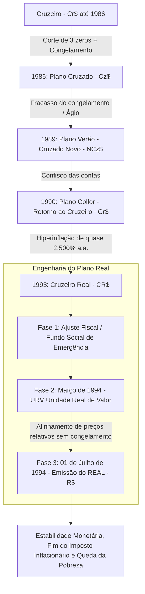

# Memória de Implementação: Instabilidade das Moedas

## Resumo do Tópico
- **Período:** 1985 – 1994
- **Categoria:** Economia
- **Foco:** A hiperinflação inercial, os planos econômicos fracassados e o sucesso da URV/Plano Real.

## Estrutura da Página (`topics/instabilidade-moedas-plano-real.html`)
- **Diagrama Mermaid:** Fluxograma mostrando a sucessão de moedas (Cruzeiro, Cruzado, etc.) culminando na engenharia em três fases do Plano Real.
- **Seção 1:** A explicação do fenômeno da inflação inercial.
- **Seção 2:** Resumo cronológico dos planos fracassados (Cruzado, Bresser, Verão, Collor).
- **Seção 3:** A equipe econômica de FHC e a inovação da URV.

## Decisões de Design
- O diagrama Mermaid foi desenhado para mostrar o ciclo vicioso das trocas de moeda e como a URV quebrou esse ciclo.

---

# Instabilidades das Moedas até o Plano Real (1994)

Como o monstro da hiperinflação destruiu salários e gerou seis reformas monetárias em menos de uma década, até a revolucionária engenharia financeira da URV.

## A Ciranda das Moedas e o Mecanismo da URV

## 1. O Drama da Hiperinflação Inercial

Nas décadas de 1980 e início de 1990, o Brasil viveu uma das piores hiperinflações do mundo, alcançando a taxa absurda de **2.477% em 1993**. Supermercados remarcavam preços com etiquetas automáticas duas vezes ao dia. Quem recebia salário precisava correr ao supermercado no mesmo dia para comprar mantimentos antes que o dinheiro perdesse o valor.

O fenômeno devia-se à **inflação inercial**: a indexação generalizada da economia. Contratos, aluguéis e salários eram reajustados pela inflação passada, projetando a inflação de ontem para os preços de amanhã em uma espiral infinita de desconfiança na moeda estatal.

## 2. A Ciranda das Trocas de Moedas Fracassadas

**1986 (Plano Cruzado):** Sarney e Dílson Funaro cortaram 3 zeros e congelaram preços. Surgiram os "Fiscais do Sarney", mas logo faltaram carnes e produtos essenciais nas prateleiras (ágio clandestino).

**1987 (Plano Bresser):** Novo congelamento de 90 dias com URP, que fracassou logo após o degelo.

**1989 (Plano Verão):** Criação do Cruzado Novo (cortou mais 3 zeros) e juros reais na estratosfera.

**1990 (Planos Collor I e II):** Retorno do Cruzeiro com bloqueio de ativos financeiros por 18 meses.

**1993 (Cruzeiro Real):** Cortou mais 3 zeros provisoriamente sob o governo Itamar Franco.

## 3. A Revolução do Plano Real e a URV

Em maio de 1993, o presidente Itamar Franco nomeou **Fernando Henrique Cardoso** para o Ministério da Fazenda. FHC reuniu uma equipe brilhante de economistas: **Pedro Malan, Edmar Bacha, André Lara Resende, Pérsio Arida e Gustavo Franco**.

A grande inovação foi não apelar para congelamentos nem confiscos. Em março de 1994, criaram a **URV (Unidade Real de Valor)**: uma moeda puramente contábil (sem cédulas impressas) que variava diariamente acompanhando o dólar. Os preços em cruzeiros reais continuavam subindo numericamente, mas em URV permaneciam estáveis. Quando todos os contratos e preços estavam equalizados na URV, em **1º de julho de 1994** a URV foi transformada na moeda definitiva: o **Real (R$)**, com a taxa de 1 Real = 1 Dólar.

A inflação desabou de 40% ao mês para menos de 2% ao mês, retirando milhões de famílias da miséria extrema pelo fim do "imposto inflacionário".
