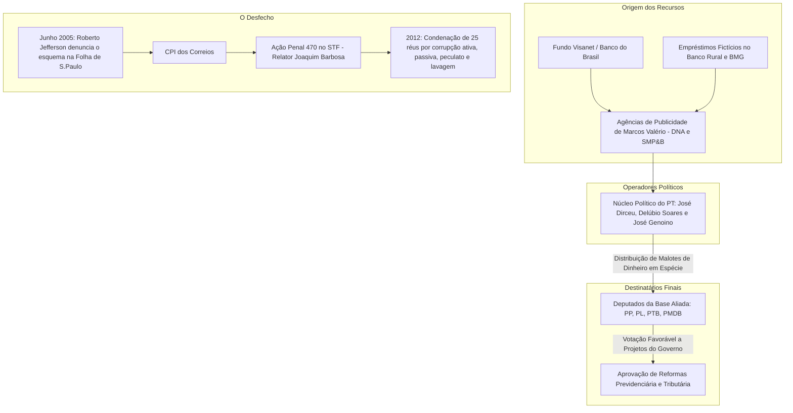

# Memória de Implementação: Mensalão

## Resumo do Tópico
- **Período:** 2005 – 2012
- **Categoria:** Crises Políticas
- **Foco:** O esquema de compra de votos no Congresso, a denúncia, a Ação Penal 470 e as condenações.

## Estrutura da Página (`topics/mensalao.html`)
- **Diagrama Mermaid:** Fluxograma detalhando a origem dos recursos, os operadores políticos, os destinatários e o desfecho no STF.
- **Seção 1:** O contexto do governo Lula e a necessidade de aprovar reformas.
- **Seção 2:** Os núcleos envolvidos (denunciante, político, financeiro, beneficiários).
- **Seção 3:** O julgamento no STF, a Teoria do Domínio do Fato e as prisões.

## Decisões de Design
- O diagrama Mermaid foi estruturado em subgrafos para separar claramente a origem do dinheiro, os operadores e o destino final.

---

# Escândalo do Mensalão (2005)

A engrenagem de corrupção que abalou o primeiro mandato de Lula: desvio de recursos públicos e empréstimos fictícios para garantir a fidelidade de deputados no Congresso Nacional.

## A Estrutura do Esquema e o Fluxo do Dinheiro

## 1. Quando e Porque Ocorreu

O escândalo veio a público em **junho de 2005**, durante o primeiro mandato do presidente Luiz Inácio Lula da Silva. O governo, eleito com minoria no Congresso, precisava aprovar reformas estruturais (como a da Previdência).

Em vez de negociar cargos e emendas de forma tradicional, o núcleo duro do governo montou um esquema de pagamentos periódicos (uma "mesada" ou "mensalão" de R$ 30 mil) a deputados de partidos aliados (PP, PL, PTB, PMDB) para garantir fidelidade nas votações.

## 2. Quem Apoiou e Políticos Envolvidos

- **O Denunciante:** O deputado Roberto Jefferson (PTB), que, após ser implicado em um escândalo nos Correios, concedeu entrevista explosiva à Folha de S.Paulo revelando o esquema.
- **O Núcleo Político:** José Dirceu (Ministro da Casa Civil e "capitão do time"), José Genoino (Presidente do PT) e Delúbio Soares (Tesoureiro do PT).
- **O Núcleo Financeiro/Operacional:** O publicitário Marcos Valério (operador das contas e saques em espécie) e dirigentes do Banco Rural (Kátia Rabello).
- **Os Beneficiários:** Parlamentares como Valdemar Costa Neto (PL), Pedro Corrêa (PP) e João Paulo Cunha (PT).

## 3. Quando e Como Acabou: O Julgamento Histórico

O caso resultou na **Ação Penal 470** no Supremo Tribunal Federal (STF), que teve seu julgamento transmitido ao vivo pela TV Justiça em 2012. Sob a relatoria do ministro **Joaquim Barbosa**, o STF inovou ao aplicar a *Teoria do Domínio do Fato* para condenar os mandantes intelectuais que não sujaram as mãos diretamente com o dinheiro.

Dos 37 réus julgados, **25 foram condenados** a penas de prisão por crimes de corrupção ativa, corrupção passiva, peculato, lavagem de dinheiro e evasão de divisas. O Mensalão marcou a primeira vez na história republicana em que políticos de alto escalão e grandes empresários foram efetivamente presos e cumpriram pena em regime fechado.
