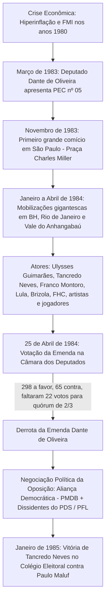

# Memória de Implementação: Movimento Diretas Já

## Resumo do Tópico
- **Período:** 1983 – 1984
- **Categoria:** Redemocratização
- **Foco:** A campanha popular pelas eleições diretas, a Emenda Dante de Oliveira e a transição via Colégio Eleitoral.

## Estrutura da Página (`topics/movimento-diretas-ja.html`)
- **Diagrama Mermaid:** Fluxograma mostrando a escalada das mobilizações, a votação da emenda e o desfecho no Colégio Eleitoral.
- **Seção 1:** O contexto de crise econômica e a apresentação da PEC.
- **Seção 2:** A diversidade de atores envolvidos (políticos, artistas, esportistas) e os grandes comícios.
- **Seção 3:** A derrota da emenda no Congresso e a articulação da Aliança Democrática.

## Decisões de Design
- Destaque para a participação da sociedade civil e da cultura pop (Democracia Corinthiana, artistas) na mobilização política.

---

# Movimento Diretas Já (1983 – 1984)

A maior mobilização popular da história brasileira: multidões nas praças exigindo o voto direto para a presidência da República e o fim definitivo do regime militar.

## A Marcha Cívica e o Desfecho Institucional

## 1. Quando e Porque Ocorreu

Em 1982, os brasileiros puderam eleger governadores estaduais pela primeira vez desde 1965. Com a oposição vencendo em estados-chave como São Paulo (Franco Montoro), Rio de Janeiro (Leonel Brizola) e Minas Gerais (Tancredo Neves), o desejo da sociedade de retomar o direito de escolher também o Presidente da República tornou-se incontrolável.

Em março de 1983, o deputado federal mato-grossense **Dante de Oliveira (PMDB)** propôs uma Emenda Constitucional restabelecendo o voto direto para a sucessão do presidente João Figueiredo. A grave recessão econômica, a inflação galopante e a dívida externa aceleraram o descontentamento popular.

## 2. Quem Apoiou e Figuras Envolvidas

O movimento uniu lideranças que abrangiam todo o espectro político, sindicatos, artistas e intelectuais:

- **Políticos da Oposição:** Ulysses Guimarães ("Senhor Diretas"), Tancredo Neves, Leonel Brizola, Luiz Inácio Lula da Silva, Fernando Henrique Cardoso e Mário Covas.
- **Artistas e Esportistas:** Fafá de Belém (que cantava o Hino Nacional nos palanques), Osmar Santos (locutor e animador oficial dos atos), Chico Buarque, Milton Nascimento, e os jogadores do movimento *Democracia Corinthiana* (Sócrates, Casagrande e Wladimir).
- **Comícios Históricos:** O comício da Candelária (Rio de Janeiro) reuniu 1 milhão de pessoas; o do Vale do Anhangabaú (São Paulo), em 16 de abril de 1984, reuniu cerca de 1,5 milhão de cidadãos vestidos de amarelo.

## 3. Quando e Como Acabou

Na noite de **25 de abril de 1984**, a Emenda Dante de Oliveira foi a votação na Câmara dos Deputados sob censura à transmissão televisiva imposta pelo governo militar. A proposta obteve 298 votos a favor, 65 contra e 3 abstenções, mas foram necessárias 320 abstenções/ausências (112 deputados da bancada governista do PDS não compareceram) para impedir que a emenda atingisse os dois terços regimentais exigidos.

Apesar da frustração popular, a energia cívica das ruas forçou a oposição a articular a **Aliança Democrática** (união do PMDB com a Frente Liberal de dissidentes do PDS liderados por José Sarney e Aureliano Chaves). Essa aliança lançou a chapa Tancredo Neves / José Sarney no Colégio Eleitoral, derrotando o candidato do regime, Paulo Maluf, em 15 de janeiro de 1985 e pondo fim a 21 anos de ditadura.
