# Memória de Implementação: Organizações Criminosas

## Resumo do Tópico
- **Período:** 1970 – Atualidade
- **Categoria:** Segurança & Estado
- **Foco:** A origem e expansão do Comando Vermelho, do PCC e das Milícias.

## Estrutura da Página (`topics/organizacoes-criminosas.html`)
- **Diagrama Mermaid:** Fluxograma com três subgrafos paralelos mostrando a evolução do CV, do PCC e das Milícias.
- **Seção 1:** A fundação do CV na Ilha Grande.
- **Seção 2:** A criação do PCC em Taubaté e sua estrutura empresarial.
- **Seção 3:** O surgimento das Milícias no Rio, a extorsão e a infiltração política.

## Decisões de Design
- Estruturação clara em três seções distintas para diferenciar a origem e o modus operandi de cada tipo de organização criminosa.

---

# Organizações Criminosas: Facções e Milícias

Como o vácuo do Estado e a corrupção policial permitiram a ascensão de impérios criminosos que controlam territórios, rotas internacionais de tráfico e influenciam a política institucional.

## A Gênese e a Estrutura do Crime Organizado

```mermaid
flowchart TD
    subgraph Comando Vermelho - CV
      A1[1979: Presídio de Ilha Grande - RJ] --> A2[Convivência entre presos comuns e presos políticos da Ditadura]
      A2 --> A3[Organização em cooperativa, controle de favelas e tráfico de cocaína nos anos 80/90]
    end

    subgraph Primeiro Comando da Capital - PCC
      B1[1993: Presídio de Taubaté - SP] --> B2[Resposta ao Massacre do Carandiru de 1992]
      B2 --> B3[Estrutura empresarial, estatuto próprio, monopólio das rotas de fronteira e portos - Santos]
    end

    subgraph Milícias
      C1[Anos 2000: Rio de Janeiro] --> C2[Policiais, bombeiros e agentes de segurança fora de serviço]
      C2 --> C3[Extorsão de moradores: Gás, TV a cabo, transporte alternativo e grilagem de terras]
      C3 --> C4[Infiltração na Política: Eleição de vereadores e deputados para proteção do esquema]
    end
```

## 1. O Comando Vermelho (CV)

A mais antiga facção do país nasceu no Instituto Penal Cândido Mendes, na Ilha Grande (RJ), em 1979. A convivência forçada pela ditadura militar entre assaltantes de banco e militantes políticos de esquerda ensinou aos criminosos comuns táticas de guerrilha, organização em células e solidariedade interna (o lema "Paz, Justiça e Liberdade").

Nos anos 1980, o CV desceu os morros cariocas e assumiu o controle do lucrativo tráfico de cocaína, estabelecendo um modelo de domínio territorial armado nas favelas que perdura até hoje.

## 2. O Primeiro Comando da Capital (PCC)

Fundado em 1993 no anexo da Casa de Custódia de Taubaté (SP), o PCC surgiu como um "sindicato do crime" para combater a opressão do sistema carcerário paulista, logo após o trauma do Massacre do Carandiru (1992).

Diferente do CV, o PCC adotou uma estrutura altamente empresarial e hierarquizada (a "Sintonia"). Hoje, é a maior organização criminosa da América do Sul, com dezenas de milhares de membros batizados. O PCC monopoliza as rotas de cocaína da Bolívia e Paraguai e controla a exportação bilionária da droga para a Europa através do Porto de Santos.

## 3. As Milícias e a Infiltração Política

Surgidas no Rio de Janeiro no início dos anos 2000, as milícias diferem das facções tradicionais por serem formadas por **agentes do próprio Estado** (policiais militares, civis, bombeiros e ex-militares). Inicialmente, vendiam "proteção" contra o tráfico para moradores de bairros periféricos.

Rapidamente, evoluíram para máfias de extorsão que monopolizam serviços essenciais: venda de botijões de gás, internet clandestina ("gatonet"), transporte alternativo (vans) e construção civil irregular (grilagem).

**O Braço Político:** As milícias utilizam o controle territorial para formar currais eleitorais, elegendo vereadores e deputados estaduais que atuam para impedir investigações e aprovar leis que beneficiem seus negócios imobiliários. O caso mais emblemático da violência miliciana contra opositores políticos foi o assassinato da vereadora **Marielle Franco** em 2018.
