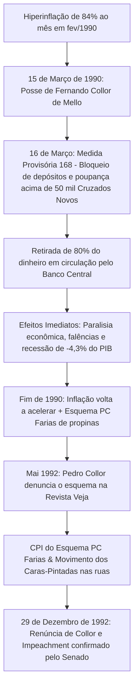

# Memória de Implementação: Plano Collor

## Resumo do Tópico
- **Período:** 1990 – 1992
- **Categoria:** Nova República
- **Foco:** O confisco da poupança, a hiperinflação, o esquema PC Farias e o impeachment.

## Estrutura da Página (`topics/plano-collor.html`)
- **Diagrama Mermaid:** Fluxograma traçando a linha causal desde a posse, o confisco, a recessão, as denúncias até o impeachment.
- **Seção 1:** O contexto hiperinflacionário e o anúncio do bloqueio de ativos.
- **Seção 2:** Os atores envolvidos (Zélia, PC Farias).
- **Seção 3:** A denúncia de Pedro Collor, os Caras-Pintadas e a renúncia/impeachment.

## Decisões de Design
- Foco na magnitude do impacto econômico (bloqueio de 80% da liquidez) e na rápida deterioração política do governo.

---

# Plano Collor e o Confisco da Poupança (1990)

Uma das medidas econômicas mais drásticas da história moderna: o bloqueio de 80% da liquidez nacional, o colapso de famílias e empresas e a queda do primeiro presidente eleito por voto direto após a ditadura.

## Dinâmica do Bloqueio de Ativos e a Trajetória da Crise

## 1. Quando e Porque Ocorreu

Em março de 1990, o Brasil encontrava-se à beira da desintegração econômica com a inflação atingindo estarrecedores **84% em apenas um mês** (fevereiro de 1990), o que equivalia a quase 2.000% ao ano.

No dia seguinte à sua posse como o mais jovem presidente eleito democraticamente, Fernando Collor de Mello e sua ministra da Fazenda, **Zélia Cardoso de Mello**, anunciaram o *Plano Brasil Novo* (Plano Collor I). O cerne do plano foi o congelamento compulsório por 18 meses de todas as aplicações financeiras, depósitos à vista e cadernetas de poupança que excedessem **50 mil cruzados novos** (cerca de US$ 1.200 na época).

## 2. Quem Apoiou e Figuras Envolvidas

- **Governo Collor:** Fernando Collor (que se vendia como "caçador de marajás"), a ministra Zélia Cardoso de Mello, o presidente do Banco Central Ibrahim Eris e Antônio Kandir.
- **Paulo César Farias (PC Farias):** Tesoureiro da campanha de Collor que operava uma vasta rede clandestina de cobrança de propinas sobre contratos públicos e liberações seletivas de cruzados bloqueados pelo Banco Central para empresários amigos.
- **Reação do Congresso e Justiça:** O Congresso aprovou a MP sob choque, mas logo se multiplicaram dezenas de milhares de mandados de segurança nos tribunais pleiteando a devolução das economias confiscadas.

## 3. Quando e Como Acabou: O Impeachment

O plano conseguiu frear os preços momentaneamente, mas ao custo de uma recessão profunda (o PIB caiu 4,3% em 1990). Meses depois, a inflação voltou a subir com força.

Em maio de 1992, **Pedro Collor de Mello**, irmão do presidente, denunciou à revista *Veja* a existência do esquema corrupto chefiado por PC Farias que custeava despesas da família presidencial (como a reforma da Casa da Dinda e compra de um Fiat Elba).

A CPI no Congresso comprovou o esquema, e a juventude foi às ruas vestida de preto e com os rostos pintados de verde e amarelo (os **Caras-Pintadas**). Em 29 de setembro de 1992, a Câmara dos Deputados aprovou a abertura do impeachment. Em 29 de dezembro de 1992, antes do veredito final, Collor renunciou, mas o Senado confirmou a cassação de seus direitos políticos por 8 anos. O vice **Itamar Franco** assumiu definitivamente o país.
