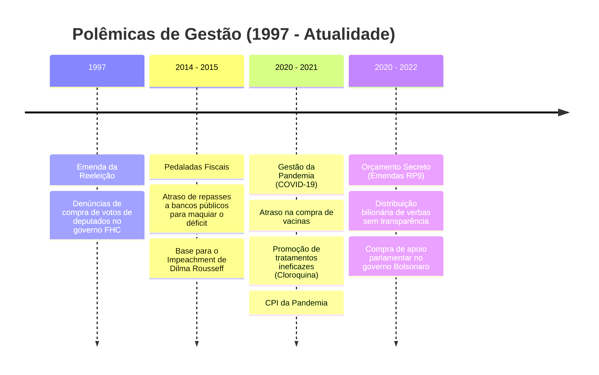

# Memória de Implementação: Polêmicas na Gestão do País

## Resumo do Tópico
- **Período:** 1990 – Atualidade
- **Categoria:** Gestão Pública
- **Foco:** Decisões controversas como a Emenda da Reeleição, Pedaladas Fiscais, gestão da Pandemia e Orçamento Secreto.

## Estrutura da Página (`topics/polemicas-na-gestao-do-pais.html`)
- **Diagrama Mermaid:** Gráfico do tipo `timeline` listando as quatro principais polêmicas em ordem cronológica.
- **Seção 1:** A Emenda da Reeleição (1997) e as denúncias de compra de votos.
- **Seção 2:** As Pedaladas Fiscais (2014-2015) e o impeachment de Dilma Rousseff.
- **Seção 3:** O Orçamento Secreto (2020-2022) e a falta de transparência.

## Decisões de Design
- Uso do formato `timeline` no Mermaid para apresentar as polêmicas de forma sequencial, facilitando a visualização histórica.

---

# Grandes Polêmicas na Gestão do País

Decisões governamentais que alteraram os rumos da República: da compra de votos para a reeleição ao uso político do orçamento e a crise sanitária da COVID-19.

## Linha do Tempo das Controvérsias Institucionais

## 1. A Emenda da Reeleição (1997)

A Constituição de 1988 proibia a reeleição para cargos do Executivo. Em 1997, o governo de Fernando Henrique Cardoso (FHC) articulou a aprovação da Emenda Constitucional nº 16, permitindo um segundo mandato consecutivo.

A polêmica estourou quando gravações revelaram que deputados federais (como Ronivon Santiago e João Maia) receberam R$ 200 mil cada para votar a favor da emenda. Os deputados renunciaram para evitar a cassação, mas o governo barrou a criação de uma CPI para investigar os financiadores do esquema, e a emenda foi mantida.

## 2. As Pedaladas Fiscais e o Impeachment (2015-2016)

Durante o governo de Dilma Rousseff, o Tesouro Nacional atrasou sistematicamente o repasse de bilhões de reais para bancos públicos (Caixa, Banco do Brasil e BNDES) que operavam programas sociais como o Bolsa Família e o Plano Safra.

Na prática, os bancos pagavam os benefícios com recursos próprios, configurando um empréstimo ilegal dos bancos ao seu controlador (a União), o que fere a Lei de Responsabilidade Fiscal. Essa maquiagem contábil para esconder o rombo nas contas públicas foi o embasamento jurídico aceito pelo Congresso para o **impeachment de Dilma Rousseff em 2016**.

## 3. O Orçamento Secreto (Emendas RP9)

Criado no final de 2019 e amplamente utilizado no governo de Jair Bolsonaro, o mecanismo das emendas de relator (RP9) permitiu que bilhões de reais do orçamento federal fossem distribuídos a deputados e senadores aliados sem que o nome do parlamentar beneficiado fosse registrado publicamente.

O esquema gerou escândalos de superfaturamento na compra de tratores, caminhões de lixo e kits de robótica em prefeituras do interior. Em 2022, o STF declarou o Orçamento Secreto inconstitucional por violar os princípios da transparência e da impessoalidade na administração pública.
