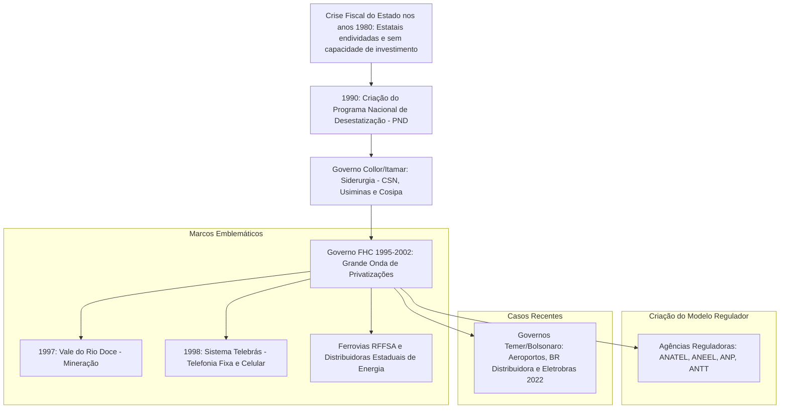

# Memória de Implementação: Privatizações

## Resumo do Tópico
- **Período:** Década de 1990 – Atualidade
- **Categoria:** Economia
- **Foco:** O Programa Nacional de Desestatização (PND), os principais leilões e o debate sobre os resultados.

## Estrutura da Página (`topics/privatizacoes.html`)
- **Diagrama Mermaid:** Fluxograma mostrando a origem do PND, os marcos emblemáticos (Vale, Telebrás) e a criação das agências reguladoras.
- **Seção 1:** Lista das principais privatizações.
- **Seção 2:** Grid comparativo com os argumentos favoráveis (ganhos) e as críticas (prejuízos).
- **Seção 3:** Atores políticos e empresariais envolvidos.

## Decisões de Design
- Uso de um grid de duas colunas na Seção 2 para apresentar o debate de forma equilibrada, listando tanto os benefícios (universalização) quanto as críticas (subavaliação, desastres).

---

# Privatizações no Brasil: História e Impactos

A mudança de paradigma do Estado empresário para o Estado regulador: os leilões do PND nos governos Collor e FHC, a universalização da telefonia e as polêmicas sobre patrimônio nacional.

## O Ciclo das Privatizações e Agências Reguladoras

## 1. Quais Foram as Principais Privatizações

- **Siderúrgicas (1991–1993):** Usiminas, Companhia Siderúrgica Nacional (CSN) e Cosipa, vendidas sob protestos inflamados no Rio de Janeiro.
- **Companhia Vale do Rio Doce (1997):** Arrematada pelo consórcio liderado pela CSN e fundos de pensão por R$ 3,3 bilhões, transformando-se em uma das maiores mineradoras do planeta.
- **Sistema Telebrás (1998):** A maior privatização da história da América Latina, leiloada na Bolsa do Rio por R$ 22 bilhões (com ágio de 64%), dividida em operadoras espelho e grupos estrangeiros como a Telefónica.
- **Setor Elétrico e Rodoviário:** Concessões da malha rodoviária federal (Via Dutra, etc.) e privatização da Eletrobras (2022) via oferta de ações diluindo a participação da União.

## 2. Houve ou Não Benefícios? O Debate

### Argumentos Favoráveis e Ganhos

- **Democratização do Acesso:** Na Telebrás estatal, uma linha telefônica custava milhares de dólares e levava anos na fila; com a privatização e celulares pré-pagos, o acesso virou universal;
- **Alívio Fiscal:** Cessou a drenagem de recursos públicos em estatais deficitárias que acumulavam prejuízos;
- **Competitividade Global:** A Vale multiplicou exportações e investimentos em pesquisa mineral.

### Críticas e Prejuízos Apontados

- **Subavaliação de Patrimônio:** Críticos alegaram que ativos estratégicos (como as reservas minerais da Vale) foram vendidos a "preço de banana";
- **Uso de "Moedas Podres":** Aceitação de títulos de dívida pública desvalorizados com 100% de valor de face nos leilões;
- **Desastres Ambientais e Tarifas:** Tragédias de Mariana (2015) e Brumadinho (2019) e aumento recorrente de tarifas de energia e pedágios.

## 3. Políticos e Empresas Envolvidos

O processo foi capitaneado pelo BNDES sob comando de economistas como Mendonça de Barros, Elena Landau e com o ministro das Comunicações **Sérgio Motta**. No lado empresarial, figuraram o consórcio Vicunha/Benjamin Steinbruch, a multinacional Telefónica, a Telecom Italia, além de fundos de pensão estatais como Previ e Petros que integraram os blocos de controle acionário.
