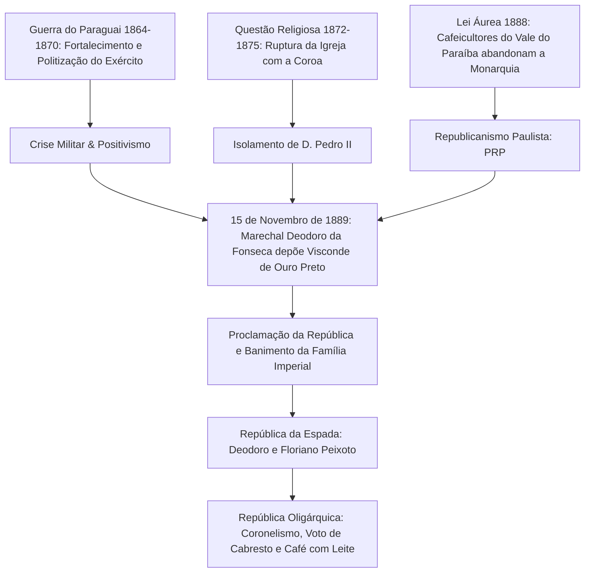

# Memória de Implementação: Proclamação da República

## Resumo do Tópico
- **Período:** 1889
- **Categoria:** República Velha
- **Foco:** O golpe militar que derrubou o Império, a ausência de participação popular e a instauração da República Oligárquica.

## Estrutura da Página (`topics/proclamacao-da-republica.html`)
- **Diagrama Mermaid:** Fluxograma mostrando as causas da queda do Império (Questão Militar, Religiosa, Abolição) e a transição para a República Oligárquica.
- **Seção 1:** Os eventos do 15 de Novembro.
- **Seção 2:** A citação de Aristides Lobo ("O povo assistiu bestializado") e a natureza elitista do golpe.
- **Seção 3:** Consequências como o Encilhamento, o coronelismo e a Política dos Governadores.

## Decisões de Design
- Uso de blockquote para a citação histórica de Aristides Lobo, enfatizando o caráter não-popular da proclamação.

---

# Proclamação da República (1889)

A crise terminal do Segundo Reinado, a insatisfação militar após a Guerra do Paraguai, a aliança com os cafeicultores paulistas e o advento da República Oligárquica.

## A Ruptura do Império e as Forças do Golpe Republicano

## 1. O que Aconteceu

Na manhã de 15 de novembro de 1889, na Praça da Aclamação (atual Praça da República) no Rio de Janeiro, o **Marechal Deodoro da Fonseca**, à frente de contingentes do Exército, liderou o levante que destituiu o gabinete ministerial do Visconde de Ouro Preto e formalizou o fim do Império de Dom Pedro II.

A família imperial foi banida do país dois dias depois, embarcando no vapor *Alagoas* para a Europa. Foi instaurado um Governo Provisório chefiado por Deodoro da Fonseca, com intelectuais positivistas e republicanos como Benjamin Constant e Rui Barbosa.

## 2. "O Povo Assistiu Bestializado"

A célebre frase do jornalista e testemunha ocular Aristides Lobo resumiu a ausência total de participação popular no episódio:

> "O povo assistiu àquilo bestializado, atônito, surpreso, sem saber o que significava. Muitos acreditaram seriamente estar vendo uma parada militar."

A República não nasceu de uma insurreição popular democratizante, mas de um arranjo de cúpula entre as Forças Armadas descontentes com o tratamento dado pelo parlamento imperial e as oligarquias do oeste paulista, organizadas no Partido Republicano Paulista (PRP), interessadas em autonomia fiscal estadual (federalismo).

## 3. Efeitos Colaterais e Consequências

- **Encilhamento e Crise Inflacionária:** A política econômica de emissão monetária desenfreada conduzida por Rui Barbosa gerou uma bolha especulativa na Bolsa do Rio de Janeiro, falências em massa e desvalorização cambial.
- **República Oligárquica e Coronelismo:** A Constituição de 1891 aboliu o voto censitário (por renda), mas excluiu mulheres, analfabetos e soldados. Com o voto aberto (não secreto), instituiu-se o **voto de cabresto** controlado pelos coronéis locais.
- **A Política dos Governadores:** Arranjo concebido pelo presidente Campos Sales no qual o governo central apoiava as elites regionais em troca da eleição de bancadas submissas no Congresso, consolidando a alternância do "Café com Leite" (São Paulo e Minas Gerais).
