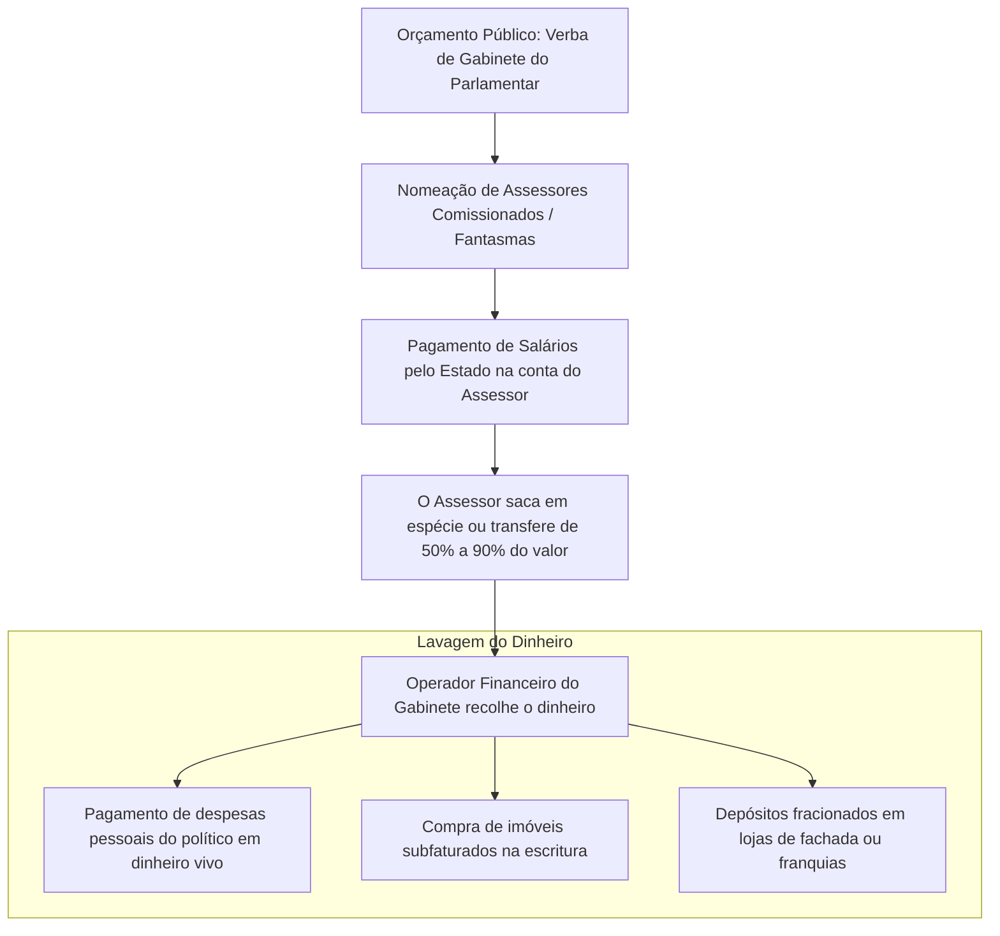

# Memória de Implementação: Rachadinhas

## Resumo do Tópico
- **Período:** Anos 2000 – Atualidade
- **Categoria:** Corrupção
- **Foco:** O desvio de salários de assessores, o caso Queiroz na ALERJ e a impunidade.

## Estrutura da Página (`topics/rachadinhas.html`)
- **Diagrama Mermaid:** Fluxograma ilustrando a mecânica do desvio (nomeação, saque, recolhimento) e a lavagem do dinheiro.
- **Seção 1:** A definição da prática e a tipificação penal (Peculato).
- **Seção 2:** O caso emblemático de Fabrício Queiroz e Flávio Bolsonaro na ALERJ.
- **Seção 3:** As dificuldades jurídicas e a impunidade gerada pelo foro privilegiado.

## Decisões de Design
- O diagrama Mermaid foca no fluxo do dinheiro, desde o orçamento público até a lavagem, para facilitar a compreensão do crime.

---

# O Esquema das "Rachadinhas" no Poder Público

A apropriação ilegal de salários de servidores comissionados por parlamentares: como funciona o esquema, a lavagem do dinheiro e os casos de repercussão nacional.

## Mecânica do Desvio e Lavagem de Dinheiro

## 1. O que é a Rachadinha?

A "rachadinha" é o termo popular para a prática criminosa em que um político (vereador, deputado ou senador) exige que os servidores nomeados para cargos de confiança em seu gabinete devolvam parte ou a quase totalidade de seus salários.

Muitas vezes, os nomeados são **"funcionários fantasmas"** — pessoas que não prestam nenhum serviço real ao poder público, emprestando apenas seus nomes e contas bancárias para que o político se aproprie da verba de gabinete. Juridicamente, a prática configura o crime de **Peculato** (art. 312 do Código Penal: apropriação de dinheiro público por funcionário público), além de associação criminosa e lavagem de dinheiro.

## 2. O Caso Queiroz e a ALERJ

Embora seja uma prática antiga e disseminada em câmaras municipais e assembleias legislativas de todo o país, o esquema ganhou os holofotes nacionais em 2018, a partir de um relatório do Conselho de Controle de Atividades Financeiras (COAF).

O COAF detectou movimentações atípicas de **R$ 1,2 milhão** na conta de **Fabrício Queiroz**, ex-policial militar e assessor do então deputado estadual Flávio Bolsonaro na Assembleia Legislativa do Rio de Janeiro (ALERJ). As investigações do Ministério Público do Rio de Janeiro (MPRJ) apontaram que Queiroz atuava como o operador financeiro do gabinete, recolhendo o dinheiro de dezenas de assessores (incluindo parentes de milicianos) e pagando despesas pessoais da família do parlamentar.

## 3. Consequências e Impunidade

Apesar da gravidade do crime, que drena centenas de milhões de reais dos cofres públicos anualmente, as condenações definitivas por rachadinha são raras.

Os processos costumam se arrastar por anos devido ao **foro privilegiado** dos políticos envolvidos e a anulações processuais em tribunais superiores (STJ e STF) baseadas em falhas na quebra de sigilo bancário ou na competência do juízo investigador, gerando um sentimento generalizado de impunidade na sociedade.
