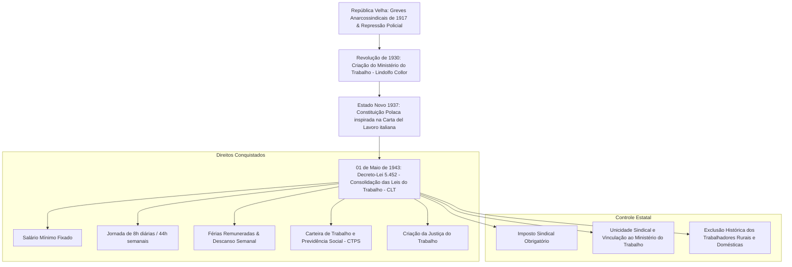

# Memória de Implementação: Regularização do Trabalho e a CLT

## Resumo do Tópico
- **Período:** 1930 – 1943
- **Categoria:** Era Vargas
- **Foco:** A criação da CLT no Estado Novo, os direitos conquistados e o controle corporativista sobre os sindicatos.

## Estrutura da Página (`topics/regularizacao-do-trabalho-clt.html`)
- **Diagrama Mermaid:** Fluxograma dividindo o tema em antecedentes, direitos conquistados e mecanismos de controle estatal.
- **Seção 1:** O contexto da Revolução de 1930 e a promulgação da CLT em 1943.
- **Seção 2:** Os objetivos políticos de Vargas (afastar influência comunista, atrelar sindicatos ao Estado).
- **Seção 3:** Grid comparativo entre os direitos assegurados e as limitações históricas (exclusão rural e doméstica).

## Decisões de Design
- Utilização de um grid de duas colunas na Seção 3 para contrastar visualmente os avanços sociais com as exclusões e deveres impostos pela legislação.

---

# Regularização do Trabalho e a CLT (1943)

A transição da "questão social como caso de polícia" para a institucionalização estatal dos direitos trabalhistas durante o Estado Novo de Getúlio Vargas.

## A Arquitetura Trabalhista e o Corporativismo Varguista

## 1. Quando e Porque Ocorreu

Na República Velha, a célebre máxima atribuída ao presidente Washington Luís de que "a questão social é um caso de polícia" ilustrava a postura estatal de reprimir greves operárias com violência e deportação de militantes anarquistas e comunistas.

Com a **Revolução de 1930**, Getúlio Vargas percebeu a necessidade de canalizar a insatisfação do proletariado urbano para sustentar a industrialização por substituição de importações. Em **1º de maio de 1943**, durante solenidade no Estádio de São Januário, Vargas assinou o Decreto-Lei nº 5.452, unificando a dispersa legislação em vigor na **Consolidação das Leis do Trabalho (CLT)**.

## 2. Quem Apoiou e os Objetivos Políticos

A CLT foi redigida por juristas de renome como **Arnaldo Süssekind, Oscar Saraiva e Segadas Vianna**, sob encomenda do ministro do Trabalho Alexandre Marcondes Filho.

O regime do Estado Novo buscou afastar a influência comunista (representada pelo PCB) e submeter o sindicalismo à tutela do Estado (modelo copiado da *Carta del Lavoro* da Itália fascista). Os sindicatos recebiam monopólio de representação por base territorial (unicidade sindical) e financiamento via imposto sindical, mas eram proibidos de fazer greves sem autorização da recém-criada Justiça do Trabalho.

## 3. Direitos e Deveres Centrais da CLT

### Principais Direitos Assegurados

- Carteira de Trabalho formalizando o vínculo de emprego;
- Salário mínimo unificado por regiões geográficas;
- Jornada de 8 horas e remuneração adicional por horas extras;
- Férias remuneradas e descanso semanal obrigatório;
- Proteção especial ao trabalho da mulher e do menor de idade;
- Indenização por demissão imotivada (posteriormente substituída pelo FGTS em 1966).

### Limitações Históricas & Deveres

- **Exclusão Rural:** Trabalhadores do campo ficaram de fora da CLT até o Estatuto do Trabalhador Rural de 1963;
- **Empregadas Domésticas:** Conquistaram igualdade de direitos plena apenas em 2013 (PEC das Domésticas);
- **Deveres:** Pontualidade, assiduidade, probidade e cumprimento de normas sob risco de demissão por justa causa (art. 482).
