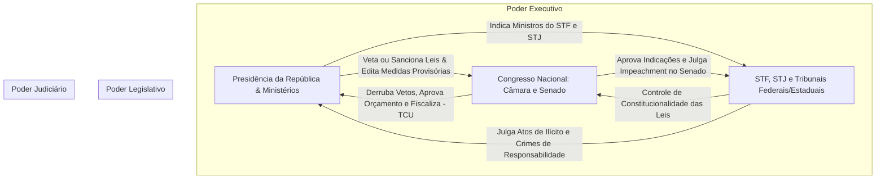

# Memória de Implementação: Os Três Poderes

## Resumo do Tópico
- **Período:** Estrutura Republicana
- **Categoria:** Instituições
- **Foco:** A separação de poderes, formas de eleição/investidura e o sistema de freios e contrapesos.

## Estrutura da Página (`topics/tres-poderes.html`)
- **Diagrama Mermaid:** Fluxograma detalhando as interações e controles mútuos entre Executivo, Legislativo e Judiciário (Checks and Balances).
- **Seção 1:** Poder Executivo (eleição e atribuições).
- **Seção 2:** Poder Legislativo (bicameralismo, eleição e atribuições).
- **Seção 3:** Poder Judiciário (composição, indicação ao STF e atribuições).

## Decisões de Design
- O diagrama Mermaid foi desenhado especificamente para mostrar as setas de controle mútuo (ex: Legislativo julga impeachment do Executivo, Judiciário controla constitucionalidade das leis).

---

# Os Três Poderes e suas Responsabilidades

Como a República Federativa do Brasil equilibra o Executivo, o Legislativo e o Judiciário: atribuições privativas, formas de escolha e mecanismos de controle mútuo.

## Mecanismo de Freios e Contrapesos (Checks and Balances)

## 1. Poder Executivo: Administrar e Governar

**Como se elege:** Por voto direto, majoritário e em dois turnos (quando nenhum candidato obtém 50% + 1 voto válido no primeiro turno em municípios com mais de 200 mil eleitores, estados e União), para mandato de 4 anos com direito a uma reeleição consecutiva.

**O que faz:** Aplica as leis, formula políticas públicas (saúde, educação, infraestrutura), gere o orçamento público, comanda a administração pública e as Forças Armadas, e conduz as relações diplomáticas internacionais.

## 2. Poder Legislativo: Legislar e Fiscalizar

**Como se elege:** No plano federal, o Congresso é bicameral:

- **Câmara dos Deputados (513 deputados):** Representam o povo. Eleitos pelo sistema proporcional com quociente eleitoral para mandato de 4 anos.
- **Senado Federal (81 senadores):** Representam os 26 Estados e o DF (3 por ente). Eleitos pelo sistema majoritário para mandatos de 8 anos (renovação alternada por 1/3 e 2/3 a cada 4 anos).

**O que faz:** Elabora e vota projetos de lei, reformas constitucionais (PECs), aprova o Plano Plurianual e a Lei Orçamentária Anual, e exerce a fiscalização contábil e política do Executivo com o auxílio do Tribunal de Contas da União (TCU).

## 3. Poder Judiciário: Julgar e Guardar a Constituição

**Como é composto:** Não há eleição popular para cargos de juiz. O ingresso se dá por concurso público de provas e títulos. Nos tribunais superiores:

- **STF (11 ministros):** Indicados pelo Presidente da República entre cidadãos de notável saber jurídico e reputação ilibada, com aprovação obrigatória por maioria absoluta do Senado Federal após sabatina pública.

**O que faz:** Aplica a legislação e resolve litígios entre cidadãos e o poder público. O Supremo Tribunal Federal (STF) atua como guarda da Constituição Federal, exercendo o controle de constitucionalidade de normas.
